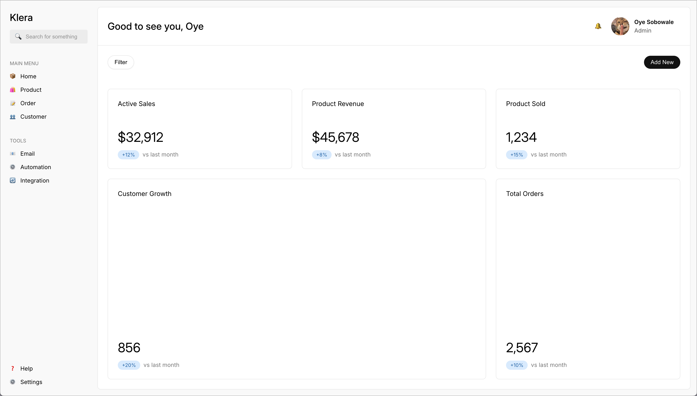

# dashboard-css-practice

A dashboard interface built with HTML, CSS, and JavaScript.

## Features
- Responsive grid layout
- Interactive search bar with focus states
- Clean card-based metrics display
- Sidebar navigation menu
- User profile section
- Modern button styles with hover effects

## Technologies
- HTML5
- CSS3 (Grid, Flexbox)
- Vanilla JavaScript

## Structure
- `index.html` - Main dashboard layout and structure
- `styles.css` - Complete styling with modern CSS features
- `script.js` - Search bar interaction handling
- `reset.css` - CSS reset for consistent styling

